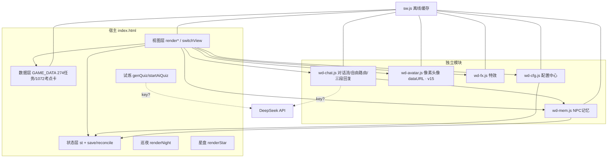
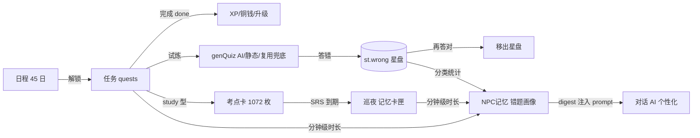
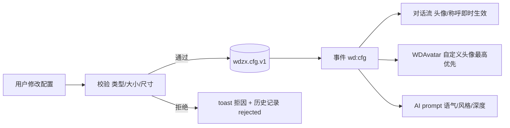

# 问道之旅 · 全局规划与设计报告

> 版本 v1.0 · 2026-09-13 · 随本轮六大需求迭代更新
> 配套文档：`ROLE-DESIGN-HANDOFF.md`（角色素材）、`game/AGENT-HANDOFF.md`（Agent 交接）

---

## 1. 项目背景与目标

### 1.1 背景
「问道之旅」是一款**北京导游考证备考**仙侠化 PWA 游戏。玩家在 45 天内穿越五幕秘境（山河游学 → 律法塔 → 行会风云 → 遗迹探秘 → 金榜台前），以「修习任务 + 温故试炼 + 巡夜记忆卡 + 错题星盘」完成考证知识点的学习闭环。考试日期 2026-11-21，与真实备考周期对齐。

### 1.2 价值定位
| 维度 | 内容 |
|---|---|
| 用户价值 | 把枯燥的导游考点背诵变成每日可打卡的仙侠修行；间隔重复（1→3→7→15 日）与错题重练符合记忆规律；AI 对话提供拟人化督学陪伴 |
| 商业价值 | 垂直赛道（导游证/导考培训）低成本获客样本；可复制到其他资格证考试（教师/法考/公考）；数据闭环可对接教培机构 |
| 目标用户 | 备考导游资格证的考生（20-35 岁，移动端为主，碎片时间学习）；二次元/国风爱好者外溢人群 |
| 市场定位 | 「游戏化督学」工具，竞品为刷题 APP（粉笔/对题库）+ 打卡社群；差异化在沉浸感与情感陪伴 |

### 1.3 成功指标
- 次日留存 ≥ 40%；45 日完课率 ≥ 25%
- 交互响应 < 200ms（pointerdown）；NPC 接话首字节 ≤ 22s 超时降级；对话滚动 60fps
- 离线可用率 100%（Service Worker 全量缓存核心资源）

## 2. 现状架构总览

### 2.1 关键约束（重要）
本项目为**无后端纯前端 PWA**：全部状态存于 localStorage，DeepSeek API 由浏览器直连（key 存 localStorage，未配置时本地降级）。因此需求中的「结构化数据库 / RESTful API / 可视化监控 / 定期备份」按如下方式落地，不做虚假承诺：

| 需求术语 | 本项目落地 | 未来后端映射 |
|---|---|---|
| 结构化数据库 | localStorage 分域 schema 化存储 + 加载时校验 | SQLite/PostgreSQL 同构表（见 §7.2 映射） |
| RESTful API | 模块函数接口 + 事件总线约定（§7.1） | 同名资源路由（POST /memories 等） |
| 定期备份 | 每日快照旋转 ×5 + JSON 导出 | 定时任务 + 对象存储 |
| 数据可视化 | 藏经阁「数据洞玄」面板（开发监控） | Grafana/管理后台 |

### 2.2 模块划分与依赖

职责边界：`index.html` 只做视图/存档/流程编排；模块通过 `window.WDxx.init({...})` 注入依赖；模块间禁止直接读写对方内部状态，一律走公共 API 或事件。
> v15 变更：原 `wd-map.js`（地图/相机/三 canvas/图层/挂载生命周期）已**整体移除**，仅保留其像素头像矩阵，抽为零 DOM、零定时器、可在 node 运行的 `wd-avatar.js`（`WDAvatar.avatarURL(id,scale)`，按 key 缓存 dataURL）；主页默认视图由地图改为对话流。

## 3. 系统架构设计

### 3.1 分层
```mermaid
graph TB
  subgraph 表现层
    V1[对话流（默认主页）]:::fe
    V2[10 功能视图 + 面板弹窗]:::fe
    V3[像素头像 WDAvatar dataURL]:::fe
  end
  subgraph 业务层
    B1[任务链/解锁 prev DAG]:::biz
    B2[间隔重复调度 SRS]:::biz
    B3[错题闭环 记录→重练→移除]:::biz
    B4[NPC认知/语言策略]:::biz
  end
  subgraph 数据层
    S1[st 存档]:::ds
    S2[wdzx.cfg.* 配置]:::ds
    S3[wdzx.mem.v1 记忆]:::ds
    S4[GAME_DATA 只读]:::ds
  end
  subgraph 外部
    E1[DeepSeek chat]:::ex
    E2[GitHub Pages]:::ex
  end
  V1-->B4-->S3
  V2---B1
  V3-->B4
  B3-->S1
  B4-.API key.->E1
  E2---SW
  classDef fe fill:#1a1230;biz fill:#241a3f;ds fill:#12251f;ex fill:#2b1a1a;
```
- **表现层**：10 视图 + 弹窗面板，默认进入对话流；头像由 WDAvatar 以像素矩阵即时生成 dataURL（零网络素材依赖）。
- **业务层**：任务 prev 链保证无环可达（gg_test 固化 DFS 校验）；SRS 间隔 1→3→7→15；错题按 pid 章节聚类。
- **数据层**：所有 localStorage 域均带版本号与加载校验（拒收即回默认并计数上报）。

## 4. 数据流程图

### 4.1 学习主闭环

### 4.2 配置生效链


## 5. 技术选型说明

| 决策点 | 选型 | 备选 | 理由 |
|---|---|---|---|
| UI 框架 | 原生 JS + 模板串 | Vue/React | 单文件交付、零构建、PWA/打包 IPA 都最小化；游戏状态简单，框架收益低。代价：需纪律性维护（模块化已补） |
| 存储 | localStorage（分域+版本+校验） | IndexedDB | 存档体量 < 1MB、同步读满足 <100ms；IndexedDB 异步反而复杂化。头像数据URL压缩后 ~30KB/张，仍可控；超限则自动降质 |
| AI | DeepSeek chat 直连 | 自建代理/本地模型 | 已有 key 生态；代理是后端演进项。风险：key 前端暴露（文档明示仅供个人使用） |
| 头像 | 像素矩阵 → canvas dataURL（WDAvatar） | assets/ 外部素材 | 零网络依赖、随包离线可用；配置中心自定义头像覆盖优先。v15 起地图画布随模块整体移除 |
| 部署 | GitHub Pages + SW 版本号 | Vercel/自有后端 | 零成本；版本号 +1 强制刷新已固化规程 |

## 6. 开发里程碑（本轮六需求）

| 阶段 | 交付物 | 验收标准 | 负责人 |
|---|---|---|---|
| P0 | 本报告 | 覆盖 6 需求方案/接口/数据结构 | AI |
| P1 | 巡夜/星盘修复 | 任意进度打开两视图均非空；错题带分类；gg_test 通过 | AI |
| P2 | 引导者云蘅 + 四章互动矩阵 | 每个 NPC 在 act1-4 各 ≥1 互动话题；对话流全员可 @ | AI |
| P3 | wd-cfg.js 配置中心 | 头像校验(类型/5MB/200px)/裁剪预览/称呼历史/属性分配/JSON 往返/历史记录/实时生效 | AI |
| P4 | wd-mem.js 记忆系统 | 五类数据入库；同步读取 <100ms；校验拒收；备份旋转；可视化面板 | AI |
| P5 | 状态栏 + 用户头像 | 1s 刷新；40×40 对称；fallback/加载态 | AI |
| P6 | 上一轮回归 + sw v14 + push | gg_test 全绿 + 浏览器 0 错误 | AI |
| P7 | v15 五需求 + sw v15 + push | 地图零残留；自由发言必有 NPC 三段回应；gg_test 全绿 + 浏览器 7 项实测 PASS | AI |

## 7. 实施方案细则

### 7.1 接口规范（内部模块 API 约定）
命名 `WDCfg.xxx / WDMem.xxx`；同步方法直接返回，异步返回 Promise；错误码 `E_CFG_* / E_MEM_*`（详见 jsdoc）；事件走 `window.dispatchEvent(CustomEvent)`：
| 事件名 | payload | 触发 |
|---|---|---|
| `wd:cfg` | {keys:[...]} | 任一配置变更 |
| `wd:mem` | {npcId,type} | 记忆写入（节流） |

未来 REST 映射（供后端化）：`POST /memories/{npcId}/events`、`GET /memories/{npcId}/digest`、`PUT /config`、`GET /config/export`、`POST /config/import`。

### 7.2 数据存储方案（localStorage 域）
```
wdzx_save          存档（st）：+hp +energy（reconcile 补默认，上限由 cfg.attr 派生钳制）
wdzx.cfg.v1        配置中心：{npcAvatar:{id:dataURL}, userAvatar, address,
                   addressHist[], selfName, bio, style{tone,humor,depth},
                   attr{str,agi,int}, hist[], rejected, ver}
wdzx.mem.v1        NPC记忆：{npc:{meet,lastMeet,learnMin,entered{},done{}{t,dur,onePass},
                   wrongs{topic:{n,lv}},lastTalk}}
wdzx.mem.bak.0-4   每日备份旋转
```
> v15：`wdzx.mapLayers.v1` 随地图模块移除而废弃（代码不再读写）。
索引策略：键值域内以 npcId/questId 为子键，O(1) 取用；错题按 `pid` 前缀聚类的索引在写入时预计算（`wrongs[topic]`）。生命周期：备份 5 份滚动覆盖；导出 JSON 为手动全量快照。

### 7.3 代码审查清单与已知发现
评分维度（各 0-5）：规范 / 安全 / 性能 / 可维护。
- 已知发现（历史审计累计）：每帧全量重绘（已修，v2 重制）；resize 冻结（已修）；全局 `$`/`hash` 耦合（已修）；交付数硬编码（已修）；**巡夜仅完成卡、空态无引导（P1 修）**；**错题无分类、温故题库可空转（P1 修）**；**DeepSeek 失败且静态题库为空时试炼 0/0 空转（P1 修）**。
- 安全项：API key 仅存 localStorage（明示）；所有用户输入入 DOM 前经 `esc()`；上传图片经 canvas 重编码（去 EXIF/GPS）。
- 性能项基准：交互 <200ms；对话滚动 60fps；记忆读取同步 O(1)；头像 dataURL 按 key 缓存仅生成一次。

## 8. 测试方案
- **单元/集成**：`gg_test.js`（node，**全绿**）——任务链可达性、存档迁移、对话降级、配置校验/导入导出往返/称呼历史/属性派生、记忆五类写入与 digest/异常清洗、四章互动矩阵、renderCfg/renderMem 面板渲染；v15 新增：sysPrompt 行为边界/自主权/三段结构/防重复注入断言、deRepeat 改口、WDAvatar dataURL 缓存、自由发言路由（关键词/云蘅兜底）、NPC 开场白生成、上下文当前关卡事实。
- **系统/场景**：浏览器实测脚本化（pointerdown 派发）——无地图按钮、默认对话视图、任意自由文本必有 NPC 三段回应、职能关键词正确路由、点 NPC 名自动开场白+回应、头像 naturalWidth>0、console 0 错误、wd-map.js 404 / wd-avatar.js 200。
- **性能指标**：上表 §5/§7.3；记忆读取 performance.now 采样。

## 9. 创新玩法建议（可行性 × 成本）
| 建议 | 说明 | 可行性 | 成本 |
|---|---|---|---|
| NPC 记忆回溯对话 | NPC 主动引用「你上周错的 S3-02 章」开场 | 高（digest 已注入 prompt） | 低 |
| 错题妖图鉴 | 星盘错题妖性化，答对即「收服」，集齐图鉴成就 | 高 | 低 |
| 云蘅每日卦辞 | 引导者按记忆画像生成当日建议（先练哪章） | 高 | 低 |
| 双端同步 | 导出 JSON → 扫码导入（iOS 主屏/浏览器双分区互通） | 中（已具备导入导出） | 中 |
| 后端化 + 排行 | 配置/记忆上云，真实排行榜 | 中（§7.1 映射已备） | 高 |

## 10. 实施状态（2026-09-13，sw wdzx-v15）
| 需求 | 状态 | 落点 |
|---|---|---|
| #1 NPC记忆 | ✅ 完成 | wd-mem.js + 配置中心→数据→「NPC 记忆档案与数据监控」面板 + wd-chat sysPrompt 注入 digest |
| #2 配置中心 | ✅ 完成 | wd-cfg.js + renderCfg 四 tab 弹窗（头像/称呼语气/属性/数据） |
| #3 报告 | ✅ 完成 | 本文件 |
| #4 状态栏/头像 | ✅ 完成 | index.html 对话视图 sticky 状态栏 1s 刷新；双方头像 40×40 对称，自定义优先+像素兜底 |
| #5 巡夜/星盘 | ✅ 完成 | renderNight 预习卡兜底（实测 14 张）；renderStar 随机小考+空态引导；fallbackQuiz 杜绝 0/0 |
| #6 NPC职能 | ✅ 完成 | index.html NPC_MATRIX（7 NPC×4 章话题）+ 引导者云蘅（@提及/fallback） |
| #7 移除地图版块（v15） | ✅ 完成 | wd-map.js 删除，UI/nav/boot/事件/图层持久化全链路清除；像素头像抽为 wd-avatar.js（零 DOM/定时器）；默认视图=对话流；sw CORE 换链、v15 |
| #8 AI 行为边界+自主权（v15） | ✅ 完成 | wd-chat.js sysPrompt：6 条硬边界（不出戏/不替玩家决定/不泄答案/不剧透/不碰现实敏感/不暴露AI）+ 6 项自主权（措辞/记忆引用/推进时机/比喻/接闲话/具体情绪反馈） |
| #9 NPC 四职能+情绪价值+下一步（v15） | ✅ 完成 | sysPrompt 四职能（主线/背景/关卡/操作）；WDMem digest 驱动具体正向反馈；CTX.quest 注入当前关卡，结尾必给"找谁/做什么" |
| #10 防重复机制（v15） | ✅ 完成 | recentReplies 注入近 5 条原话+禁开头/句式/结尾复用；输出后 deRepeat 撞 4 字开头自动改口；fallback 双切口按小时轮换 |
| #11 NPC 名点击+三段回复（v15） | ✅ 完成 | 对话流 NPC 名渲染为 .nl[data-npc] 可点击；talkToNpc 自动生成玩家口吻开场白；回复强制 情境→剧情→任务 三段（≤220字，降级话术同构） |
| #12 自由群聊对话（v15） | ✅ 完成 | sendChat 任意文本入档；routeNpc 职能关键词→当前关卡接洽人→云蘅兜底，必有 NPC 回应；@人/@全员保留；输入框 hint 更新 |
